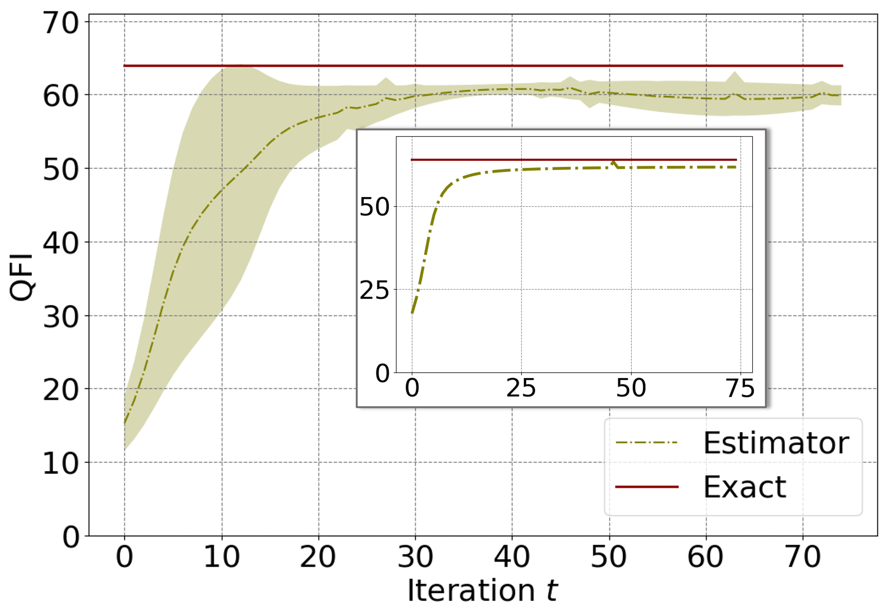
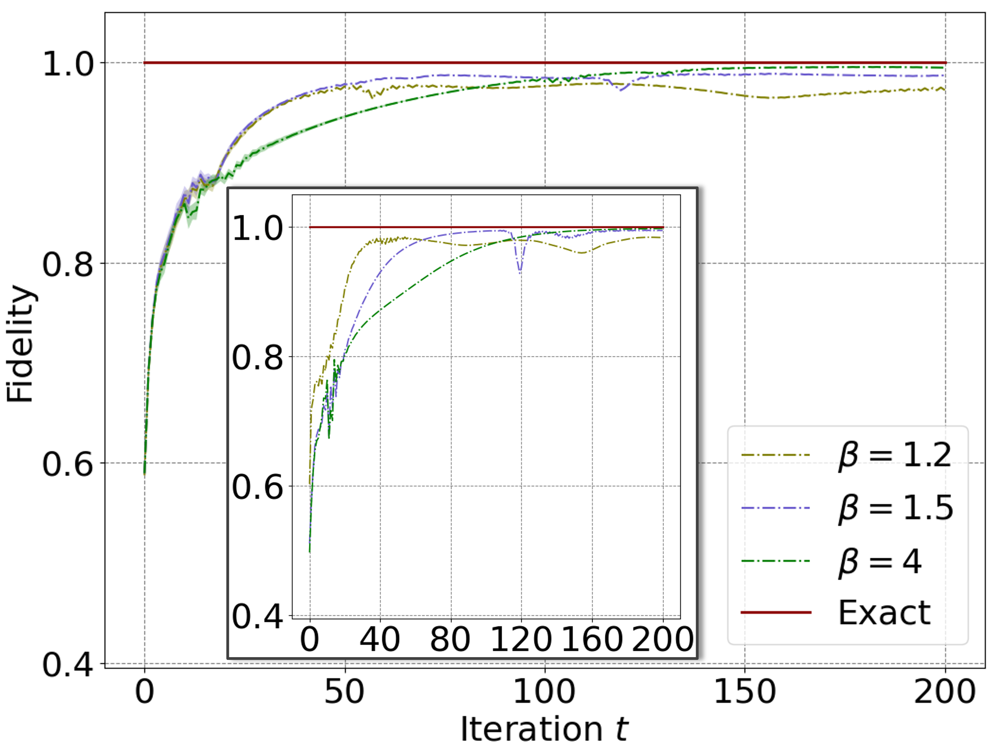

# QAE-based-learning-protocols
This repository includes code in our paper "[On exploring practical potentials of quantum auto-encoder with advantages](https://arxiv.org/pdf/2106.15432)".


The fields of quantum computing and machine learning have witnessed significant advancements due to their frequent interactions. One remarkable achievement is the development of Quantum Auto-Encoder (QAE) as a leading approach to overcome the challenges of high dimensionality in the quantum world. However, despite its promising capabilities, the practical applications of QAE with provable advantages over classical counterparts have not been explored much, due to issues such as data loading bottlenecks and non-convex optimization landscapes. In our study, we propose three effective QAE-based learning protocols: QAE-based fidelity estimator, QAE-based quantum Fisher information estimator, and QAE-based quantum Gibbs state solver that address complex learning problems in quantum systems that are difficult to solve using classical methods. These protocols can be executed on near-term quantum machines, thanks to the versatility of QAE. 


---

## Requirements
```
pennylane==0.28.0
numpy==1.23.4
scipy==1.9.2
```


## Execution of QAE-based learning protocols
* Quantum state fidelity estimation
  ```shell
  cd QAE-based_Fidelity_Estimator
  python QAE_Fidelity_estimator_low_rank_state.py    # train QAE-based fidelity estimator
  ```

* Quantum Fisher information estimation
  ```shell
  cd QAE-based_QFI_Estimator
  python Quantum_Fisher_Information_Estimator.py    # train QAE-based quantum Fisher information estimator
  ```

* Quantum Gibbs state preparation
  ```shell
  cd QAE-based_Gibbs_Solver
  python QAE_Gibbs_Estimator.py    # train QAE-based Gibbs state solver
  ```


## Experiment results
* Quantum state fidelity estimation

(a) The averaged fidelity estimation results returned by QAE-based fidelity estimator. The labels QAEFL and QAEFU refer to the bound in Theorem 2, respectively, where $\delta$ is the loss of QAE. The label "SSFBU" ("SSFBL") is super-fidelity (sub-fidelity) bounds.  (b) The top-1 fidelity estimation results achieved by QAE-based fidelity estimator. All notations follows the same meaning as those in (d). (c) The averaged training loss of the QAE-based fidelity estimator in the first stage. The label “K = a” refers to the employed number of latent qubits of the QAE-based fidelity estimator is a. The shadow region refers to the variance. (d) The top-1 training loss achieved by QAE-based fidelity estimator. All notations follows the same meaning as those in (c). 

* Quantum Fisher information estimation

 The outer and inner plots depict the average and top-1 performance of the proposed QAE-based QFI estimator. The label "Exact" and "Estimator" separately represent the maximum QFI that can be achieved and the estimated QFI returned by the proposed estimator. 

* Quantum Gibbs state preparation

 The label "$\beta=x$"" represents how the average fidelity $\FF(\rho(\bm{\gamma}),\rho_G)$ evolves in $T=200$ iterations when the inverse temperature $\beta$ is set as $x$. The shadow region represents variance. The inner plot shows the top-1 performance of each setting.

  ---

## Citation
If you find our code useful for your research, please consider citing it:
```
@article{du2021exploring,
  title={On exploring practical potentials of quantum auto-encoder with advantages},
  author={Du, Yuxuan and Tao, Dacheng},
  journal={arXiv preprint arXiv:2106.15432},
  year={2021}
}
```
